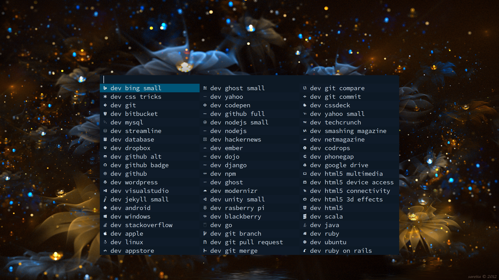

# Refactored DMenu

No matter how hard I looked around,
nobody seems to have cleaned DMenu up for me.
Perhaps we should do it together.

I use DMenu for everything.



DMenu can be inline input, auto complete input,
and output.


However, if I wanted to modify its source code
I'd have to clean it up myself.

```c
if ((i += (lines > 0) ? bh : textw_clamp(prev->left->text, n)) > n * columns)
  break;
```

```c
    XFree(info);
  } else
#endif
  {
```

[DMenu](https://tools.suckless.org/dmenu/)
is an amazing project, but not made with
extensibility in mind. The way it's made
gives me an itch, and the way people use it
hurts my soul.

Well I didn't sit down and start cleaning,
but as I added new features
it started to get cleaner.

```c
int
main(int argc, char *argv[])
{
  int fast = handleargs(argc, argv);
  initxwin();
  considerbsdfail();
  int num_of_lines = grabandreadandgetnumlines(fast);
  setup(num_of_lines);
  run();
  return 1; /* unreachable */
}
```

The dream is that one day it's so clean that
one can add any feature within a reasonable
amount of time. I wish this was the standard
for all software to be honest. Currently there
are roadblocks such as making the number of
columns depend on the amount of input, which
is absurd. I'm the ruler of the machine.

This is my first repository and there are
many questionable decisions, such as keeping the
name of the program as 'dmenu', please inform me
if you know something I don't know about regarding
licencing.

## Priorities

- Separate into modules, meaning multiple files
- Write tests, because I fear my own code
- Remove globals, they *have* caused problems
- Still support BSD hopefully

If someone can convince me to still support Xinerama,
I will. But so far I can't see a purpose for it.

Also I don't have a BSD environment myself.

## Usage

```sh
git clone https://github.com/TheodoreAlenas/refactored-dmenu
make
./dmenu --help  # see an overview of the commands
mv dmenu ~/.local/bin/dmenu  # Sorry! I'll fix 'make install'
```

